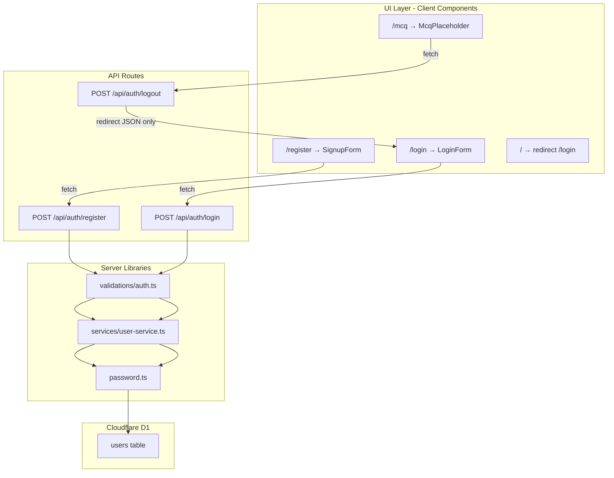

Date created: 2026-08-30
Date last modified: 2026-09-04

# Register / Login / Logout - Technical PRD

## Overview/Problem

Teachers building a collaborative quiz test bank need a secure way to create accounts and sign in before they can contribute questions. Today the application has no user identity layer — anyone who reaches the app sees the same unauthenticated experience, and there is no database table to store teacher profiles or credentials.

Sprint #1 establishes the minimum authentication foundation: user registration, login, logout/navigation, a persistent `users` table in Cloudflare D1, and a user service with only the operations required by those flows. After signing in or registering, the user is redirected to a static placeholder page that will eventually host MCQ functionality. Nothing beyond that is built in this sprint.

**Implementation status (2026-09-04):** Phases 0–4 are **complete** on branch `feature/sprint1-auth-foundation`. Register, login, logout API routes, password hashing, UserService, D1 schema, Vitest test suite (28 tests), and shadcn/ui auth pages are implemented and verified. Phase 5 (final sprint verification checklist) remains.

---

## Hypothesis

We believe that providing simple email/username-based registration and login with securely hashed passwords will give teachers a reliable identity foundation so that future phases can attach quiz and test-bank features to authenticated users.

---

## Implementation Record

Complete record of what was built in Sprint #1, through Phase 4.

### Git branch and commits

| Commit | Message | Phase |
|--------|---------|-------|
| `a815d47` | `chore(test): add Vitest Workers test harness (Phase 0)` | 0 |
| `4c7d8b3` | `feat(db): add users table with TDD schema tests (Phase 1)` | 1 |
| `c9eca71` | `feat(auth): add password hashing and UserService (Phase 2)` | 2 |
| `1a32d73` | `feat(auth): add register, login, and logout API routes (Phase 3)` | 3 |
| `ba43542` | `feat(ui): add login, register, and MCQ placeholder pages (Phase 4)` | 4 |

Branch: `feature/sprint1-auth-foundation` (pushed to `origin` through Phase 3).

### Architecture



### File inventory

| Layer | File | Purpose |
|-------|------|---------|
| **Config** | `wrangler.jsonc` | D1 binding `DB` → `quiz-maker-db` |
| **Migration** | `migrations/0001_create_users_table.sql` | `users` table schema |
| **Password** | `src/lib/password.ts` | PBKDF2 `hashPassword` / `verifyPassword` |
| **UserService** | `src/lib/services/user-service.ts` | `createUser`, `getUserByUsernameOrEmail` |
| **Validation** | `src/lib/validations/auth.ts` | Manual request validation (no Zod) |
| **API** | `src/app/api/auth/register/route.ts` | Registration endpoint |
| **API** | `src/app/api/auth/login/route.ts` | Login endpoint |
| **API** | `src/app/api/auth/logout/route.ts` | Logout endpoint |
| **UI** | `src/components/login-form.tsx` | shadcn login block + API wiring |
| **UI** | `src/components/signup-form.tsx` | shadcn signup block + API wiring |
| **UI** | `src/components/mcq-placeholder.tsx` | Static MCQ card + logout |
| **Pages** | `src/app/login/page.tsx`, `register/page.tsx`, `mcq/page.tsx`, `page.tsx` | Route pages |
| **Tests** | `test/schema.test.ts` | D1 schema (5 tests) |
| **Tests** | `src/lib/password.test.ts` | Password (5 tests) |
| **Tests** | `src/lib/services/user-service.test.ts` | UserService (7 tests) |
| **Tests** | `src/app/api/auth/**/route.test.ts` | API routes (11 tests) |
| **Config** | `tsconfig.json` | Excludes `test/`, `**/*.test.ts`, `vitest.config.mts` from production typecheck |
| **Test harness** | `vitest.config.mts`, `test/apply-migrations.ts`, `test/env.d.ts`, `test/MANUAL_UI_CHECKLIST.md` | Vitest + in-memory D1 + manual UI checklist |

D1 database `quiz-maker-db` is bound as `DB` in `wrangler.jsonc`:

```21:27:wrangler.jsonc
	"d1_databases": [
		{
			"binding": "DB",
			"database_name": "quiz-maker-db",
			"database_id": "564c4894-fdd5-4d57-9e77-b77ab0a78767"
		}
	]
```

Migration applied locally (`--local`) and remotely by project owner. Agents must not apply remote migrations.

### Password hashing (implemented)

PBKDF2 via Web Crypto API — 100,000 iterations, 16-byte salt, 32-byte key, SHA-256. Stored format: `{base64Salt}:100000:{base64Hash}`.

```38:43:src/lib/password.ts
export async function hashPassword(plainPassword: string): Promise<string> {
	const salt = crypto.getRandomValues(new Uint8Array(SALT_LENGTH));
	const hash = new Uint8Array(await deriveKey(plainPassword, salt));

	return `${bytesToBase64(salt)}:${PBKDF2_ITERATIONS}:${bytesToBase64(hash)}`;
}
```

`verifyPassword` uses constant-time comparison of derived bytes (`src/lib/password.ts:45-75`).

### UserService (implemented)

D1 access via `getCloudflareContext()`; only `createUser` and `getUserByUsernameOrEmail` exposed.

- `createUser` hashes password before insert, returns user without `passwordHash` (`src/lib/services/user-service.ts:64-106`)
- `getUserByUsernameOrEmail` looks up by `username = ?1 OR email = ?1` (`src/lib/services/user-service.ts:108-123`)
- `DuplicateUserError` thrown on unique constraint violation (`src/lib/services/user-service.ts:22-27`)

### Request validation (implemented — manual, not Zod)

`src/lib/validations/auth.ts` exports `validateRegisterBody` and `validateLoginBody`. Used by API route handlers before calling UserService.

### API routes (implemented)

**Register** — validates body, calls `createUser`, returns 201 + redirect:

```25:30:src/app/api/auth/register/route.ts
	try {
		await createUser(validation.data);
		return NextResponse.json(
			{ success: true, redirect: "/mcq" },
			{ status: 201 },
		);
```

**Login** — validates body, looks up user, verifies password, returns 200 or 401:

```30:39:src/app/api/auth/login/route.ts
	const user = await getUserByUsernameOrEmail(validation.data.usernameOrEmail);
	const passwordMatches =
		user !== null &&
		(await verifyPassword(validation.data.password, user.passwordHash));

	if (!passwordMatches) {
		return NextResponse.json(INVALID_CREDENTIALS, { status: 401 });
	}

	return NextResponse.json({ success: true, redirect: "/mcq" }, { status: 200 });
```

**Logout** — returns redirect JSON only; no server state (`src/app/api/auth/logout/route.ts`).

### UI pages (implemented — shadcn blocks + Tailwind)

Client components POST to API routes and navigate with `useRouter().push()` on success.

**LoginForm** — `usernameOrEmail` + password, links to `/register`:

```44:48:src/components/login-form.tsx
		try {
			const response = await fetch("/api/auth/login", {
				method: "POST",
				headers: { "Content-Type": "application/json" },
				body: JSON.stringify({ usernameOrEmail, password }),
```

**SignupForm** — firstName, lastName, username, email, password, confirmPassword; client validation then POST `/api/auth/register` (`src/components/signup-form.tsx`).

**McqPlaceholder** — static card; logout POSTs `/api/auth/logout` then navigates to `/login`:

```18:27:src/components/mcq-placeholder.tsx
	async function handleLogout() {
		setIsLoggingOut(true);

		try {
			const response = await fetch("/api/auth/logout", { method: "POST" });
			const data = (await response.json()) as { redirect?: string };

			if (response.ok) {
				router.push(data.redirect ?? "/login");
```

**Home** — server redirect to `/login` (`src/app/page.tsx`).

Adaptations from shadcn block templates: removed Google OAuth and forgot-password links; split full name into first/last; added username field; login uses `usernameOrEmail` not email-only.

### Test suite (implemented)

| Suite | File | Tests |
|-------|------|-------|
| Schema | `test/schema.test.ts` | 5 |
| Password | `src/lib/password.test.ts` | 5 |
| UserService | `src/lib/services/user-service.test.ts` | 7 |
| Register API | `src/app/api/auth/register/route.test.ts` | 5 |
| Login API | `src/app/api/auth/login/route.test.ts` | 5 |
| Logout API | `src/app/api/auth/logout/route.test.ts` | 1 |
| **Total** | | **28** |

Run: `npm test`. Vitest config: `vitest.config.mts` with `@cloudflare/vitest-plugin`, in-memory D1, migration binding.

### Manual verification (Phase 4 — verified by project owner)

Verified locally (login page navigation, register, login, logout):

| Step | Scenario | Status |
|------|----------|--------|
| 4.1 | Register → redirect `/mcq` | Verified |
| 4.2 | Duplicate registration error | Not explicitly re-tested (covered by Vitest) |
| 4.3 | Login with username → `/mcq` | Verified |
| 4.4 | Login with email → `/mcq` | Verified |
| 4.5 | Wrong password error | Not explicitly re-tested (covered by Vitest) |
| 4.6 | Logout → `/login` | Verified |
| 4.7 | Direct `/mcq` access | Verified (page loads) |
| 4.8 | `/` → `/login` | Verified |

### Infrastructure fixes applied during implementation

| Issue | Fix | Files |
|-------|-----|-------|
| OpenNext build missing `esbuild` | Added `esbuild@^0.27.0` devDependency | `package.json` |
| `TEST_MIGRATIONS` TypeScript error in production build | Exclude `test/` from root `tsconfig.json`; augment `Cloudflare.Env` in `test/env.d.ts` | `tsconfig.json`, `test/env.d.ts` |
| Vitest plugin package rename | Use `@cloudflare/vitest-plugin` (not `vitest-pool-workers`) | `vitest.config.mts` |

---

## Scope

### In Scope (Sprint #1 only)

This sprint is strictly limited to the following. Do not build adjacent functionality because it may be useful later.

**Authentication flows**

- User registration via `POST /api/auth/register`
- User login via `POST /api/auth/login`
- Logout/navigation via `POST /api/auth/logout` (redirect-only; see Authentication Model)
- Redirect-only post-auth navigation to `/mcq` after successful register or login

**Minimum user data layer**

- Cloudflare D1 `users` table with columns required for register/login (see Database Schema)
- D1 migration for the `users` schema
- `src/lib/password.ts` — hash and verify functions using Web Crypto PBKDF2
- `UserService` in `src/lib/services/` with **only** the methods required by register and login (see UserService)
- Secure password hashing before storage; plaintext passwords are never persisted

**UI (login/register and placeholder only)**

- Registration page (`/register`) with form validation
- Login page (`/login`) with form validation
- Minimal MCQ placeholder page (`/mcq`) — static content and logout button only
- Home page (`/`) redirecting or linking to login/register

**Validation and errors**

- Request validation on API routes — **implemented** with manual validation in `src/lib/validations/auth.ts` (Zod was considered but not installed; see Dependencies)
- Basic error handling and user-facing error messages

**Testing (required deliverable — TDD)**

- Vitest as the unit/integration test framework
- `@cloudflare/vitest-plugin` for Workers-runtime and in-memory D1 testing
- Test-driven development: write failing tests at the start of each phase, implement until green
- Automated coverage for password hashing, UserService, and all auth API routes
- Manual verification for UI flows and scenario 10 (direct `/mcq` access)

### Out of Scope

What is explicitly not being built in Sprint #1:

- MCQ creation, editing, listing, or test-bank functionality
- Multiple-choice question data model or UI beyond a static placeholder
- Teacher collaboration features (sharing, permissions, teams)
- Social / OAuth login (Google, Microsoft, etc.)
- Cookies, JWTs, server-side sessions, or any persistent auth state
- Password reset or email verification flows
- Role-based access control (admin vs teacher)
- User profile editing UI
- `UserService.updateUser` or `UserService.deleteUser`
- Route protection middleware that blocks unauthenticated access to `/mcq`
- Personalized welcome or user-specific content on `/mcq`
- `getUserById` or other read methods not required by register/login
- Playwright or other browser E2E automation
- Any feature not directly required to register, log in, log out, or navigate after auth

### Cut

Things that were considered during planning but deliberately removed (and why):

- **`UserService.updateUser` and `deleteUser`** — Not required for register, login, or logout in Sprint #1. Deferred to a future sprint when profile or account management is in scope.
- **`getUserById`, `getUserByUsername`, `getUserByEmail` as separate methods** — Login needs a single lookup by username-or-email; separate read methods add surface area with no Sprint #1 caller.
- **`updated_at` column** — Exists only to support updates; omitted from Sprint #1 schema.
- **User object in API success responses** — With no session and no personalized UI, returning user data from register/login adds complexity without a consumer. Success responses return `{ success, redirect }` only.
- **Personalized first-name welcome on `/mcq`** — Requires carrying user state across navigation; incompatible with the no-session model and out of Sprint #1 scope.
- **JWT access/refresh tokens** — Deferred to a future session-management phase.
- **HTTP cookies and server-side sessions** — Sprint #1 uses redirect-only auth; persistent sessions deferred.
- **bcrypt via new npm dependency** — Password hashing uses Web Crypto PBKDF2 (native to Workers; no new package).
- **Server Actions instead of API routes** — User requested register, login, and logout endpoints; forms POST to API routes.
- **Building CRUD or read APIs beyond auth** — User service is not a general-purpose user admin layer in this sprint.
- **Testing as a final-only phase** — Tests are written at the start of each phase (TDD), not bolted on at the end.

---

## Test-Driven Development Approach

Sprint #1 follows **test-driven development (TDD)** using **Vitest**. Tests are written at the **beginning** of each implementation phase, run while still failing (red), then implementation proceeds until those tests pass (green). Passing tests plus the acceptance criteria for that phase are the signal that the phase is complete.

### TDD workflow per phase

```
1. RED    — Write tests for the phase's deliverables; run `npm test` → tests fail
2. GREEN  — Implement the minimum code to make those tests pass
3. VERIFY — Run `npm test` again → tests pass; check phase acceptance criteria
4. NEXT   — Move to the next phase; repeat
```

### Testing stack (approved)

| Package | Purpose |
|---------|---------|
| **`vitest`** | Test runner, assertions, mocking (`vi.mock`) |
| **`@cloudflare/vitest-plugin`** | Runs tests in the Workers runtime with in-memory D1 via Miniflare |

Use `@cloudflare/vitest-plugin` (the current package name; replaces `@cloudflare/vitest-pool-workers`).

### Test infrastructure files

| File | Purpose |
|------|---------|
| `vitest.config.mts` | Vitest + Workers pool config; in-memory D1; `@/` alias |
| `test/apply-migrations.ts` | Applies D1 migrations before tests; clears `users` between tests |
| `test/env.d.ts` | Types for `cloudflare:test` (`env.DB`, `env.TEST_MIGRATIONS`) |
| `test/tsconfig.json` | TypeScript config for test files |

### Mocking pattern for route and service tests

`getCloudflareContext()` does not work natively in Vitest. Tests mock it to inject the in-memory `env.DB`:

```typescript
import { env } from "cloudflare:test";
import { vi } from "vitest";

vi.mock("@opennextjs/cloudflare", () => ({
  getCloudflareContext: vi.fn(async () => ({ env })),
}));
```

### Commands

| Command | Purpose |
|---------|---------|
| `npm test` | Run full Vitest suite once (`vitest run`) |
| `npm run test:watch` | Run Vitest in watch mode during development |

### What is automated vs manual

| Area | Approach |
|------|----------|
| Password hashing/verification | Vitest (`src/lib/password.test.ts`) |
| UserService | Vitest (`src/lib/services/user-service.test.ts`) |
| Register/login/logout API routes | Vitest (`src/app/api/auth/**/route.test.ts`) |
| D1 schema | Vitest (`test/schema.test.ts`) |
| UI pages (register, login, mcq) | Manual via `npm run preview` |
| Direct `/mcq` access (scenario 10) | Manual via `npm run preview` |

---

## Technical Requirements

### Database Schema

Database binding name: `DB` (standard D1 convention for this project).

```sql
CREATE TABLE users (
  id TEXT PRIMARY KEY DEFAULT (lower(hex(randomblob(16)))),
  first_name TEXT NOT NULL,
  last_name TEXT NOT NULL,
  username TEXT NOT NULL UNIQUE,
  email TEXT NOT NULL UNIQUE,
  password_hash TEXT NOT NULL,
  created_at DATETIME DEFAULT CURRENT_TIMESTAMP
);

CREATE INDEX idx_users_username ON users (username);
CREATE INDEX idx_users_email ON users (email);
```

**Column notes:**

| Column | Type | Notes |
|--------|------|-------|
| `id` | TEXT PK | Auto-generated UUID-like hex string |
| `first_name` | TEXT | Required; collected at registration |
| `last_name` | TEXT | Required; collected at registration |
| `username` | TEXT | Required, unique; may be an email address |
| `email` | TEXT | Required, unique; may match `username` |
| `password_hash` | TEXT | PBKDF2 output stored as `{salt}:{iterations}:{hash}` (base64) |
| `created_at` | DATETIME | Set on insert |

**Setup steps (completed):**

1. ~~`npx wrangler d1 create quiz-maker-db`~~ — database `quiz-maker-db` created
2. ~~Add `d1_databases` block to `wrangler.jsonc` with binding `DB`~~ — see `wrangler.jsonc:21-27`
3. ~~Migration file `migrations/0001_create_users_table.sql`~~ — matches schema above
4. ~~`npx wrangler d1 migrations apply quiz-maker-db --local`~~ — applied locally
5. Remote migration applied by project owner (agents must not run `--remote`)
6. `npm run cf-typegen` — run after binding changes

---

### Authentication Model (Sprint #1 — temporary redirect-only flow)

Sprint #1 uses a **temporary redirect-only authentication flow**. It deliberately does **not** introduce cookies, JWTs, server-side sessions, or any mechanism that persists auth state across requests or browser restarts.

**How each flow works:**

1. **Register** — Validates input, hashes password, creates user in D1, returns `{ success: true, redirect: "/mcq" }`. Client navigates to `/mcq`.
2. **Login** — Looks up user by username or email, verifies password hash, returns `{ success: true, redirect: "/mcq" }`. Client navigates to `/mcq`.
3. **Logout** — Returns `{ success: true, redirect: "/login" }`. Client navigates to `/login`.

**Explicit limitations (accepted for Sprint #1):**

| Limitation | Explanation |
|------------|-------------|
| **`/mcq` is not protected** | Any visitor who knows the URL can load `/mcq` directly. There is no server-side check for prior login or registration. |
| **Logout does not invalidate a session** | No persistent session exists. Logout is navigation only — it sends the user to `/login` but does not revoke credentials or block future direct access to `/mcq`. |
| **No "logged in" state after navigation** | Closing the tab, refreshing `/mcq`, or opening `/mcq` in a new tab does not reflect whether the user previously registered or logged in. |
| **Temporary by design** | This model is a Sprint #1 scaffold. A future sprint will add session management and route protection. |

---

### API Endpoints

#### POST /api/auth/register

Creates a new user account via `UserService.createUser`.

**Request Body:**

```json
{
  "firstName": "Jane",
  "lastName": "Smith",
  "username": "jane.smith@school.edu",
  "email": "jane.smith@school.edu",
  "password": "SecurePass123"
}
```

**Validation rules:**

- `firstName`, `lastName` — required, 1–100 characters
- `username` — required, 3–100 characters, alphanumeric plus `.`, `_`, `@`, `-`
- `email` — required, valid email format
- `password` — required, minimum 8 characters

**Response:**

- Success (201): `{ "success": true, "redirect": "/mcq" }`
- Error (400): Validation failure — `{ "error": "Validation failed", "details": [...] }`
- Error (409): Username or email already exists — `{ "error": "Username or email already in use" }`
- Error (500): Server error — `{ "error": "Internal server error" }`

Password and `password_hash` are never returned.

---

#### POST /api/auth/login

Authenticates an existing user via `UserService.getUserByUsernameOrEmail` and `verifyPassword`.

**Request Body:**

```json
{
  "usernameOrEmail": "jane.smith@school.edu",
  "password": "SecurePass123"
}
```

The server looks up the user where `username = ?1 OR email = ?1`.

**Response:**

- Success (200): `{ "success": true, "redirect": "/mcq" }`
- Error (400): Validation failure
- Error (401): Invalid credentials — `{ "error": "Invalid username/email or password" }` (same message for unknown user and wrong password)
- Error (500): Server error

---

#### POST /api/auth/logout

Sign-out navigation endpoint. No server-side state to clear.

**Request Body:** none required

**Response:**

- Success (200): `{ "success": true, "redirect": "/login" }`

---

### UserService

Location: `src/lib/services/user-service.ts`

All D1 access for users in Sprint #1 goes through this service. Route handlers must not query `users` directly.

**Sprint #1 interface only — no update, delete, or extraneous read methods:**

```typescript
export type UserRecord = {
  id: string;
  firstName: string;
  lastName: string;
  username: string;
  email: string;
  passwordHash: string;
  createdAt: string;
};

export type CreateUserInput = {
  firstName: string;
  lastName: string;
  username: string;
  email: string;
  password: string; // plaintext — hashed inside createUser before insert
};

// Methods required by Sprint #1 auth flows
createUser(input: CreateUserInput): Promise<Omit<UserRecord, "passwordHash">>
getUserByUsernameOrEmail(identifier: string): Promise<UserRecord | null>
```

**Password handling:**

- `createUser` calls `hashPassword()` from `src/lib/password.ts` before insert.
- Login route handler calls `getUserByUsernameOrEmail`, then `verifyPassword()` from `src/lib/password.ts`.
- Plaintext passwords exist only in memory during the request lifecycle.
- `passwordHash` is internal to the service layer and is never exposed in API responses.

---

### User Interface Requirements

UI pages use **shadcn/ui blocks** (Tailwind CSS v4) built on the project's existing `base-nova` components (`Card`, `Button`, `Input`, `Field`, etc.). Styling is utility-first via Tailwind classes in `className` props — no separate CSS modules.

#### shadcn Block Components

| Component | Location | Used by |
|-----------|----------|---------|
| `LoginForm` | `src/components/login-form.tsx` | `/login` |
| `SignupForm` | `src/components/signup-form.tsx` | `/register` |
| `McqPlaceholder` | `src/components/mcq-placeholder.tsx` | `/mcq` |

Based on shadcn login/signup block layouts. Adapted for Sprint #1 scope:

- **Removed** (out of scope): Google/social login buttons, forgot-password link
- **Register fields** adjusted from block default: split first/last name, added username (PRD requires `firstName`, `lastName`, `username`, `email`, `password`, `confirmPassword` — not a single "Full Name" field)
- **Login field** adjusted: `usernameOrEmail` instead of email-only

#### Registration Page (`/register`)

- Page: `src/app/register/page.tsx` — centered layout wrapping `SignupForm`
- Form fields: First Name, Last Name, Username, Email, Password, Confirm Password
- Client-side validation mirrors server rules; Confirm Password must match Password
- Submit POSTs to `/api/auth/register`
- On success: navigate to `/mcq`
- On error: display inline error message(s) via `FieldError`
- Link to login page: "Already have an account? Log in"

#### Login Page (`/login`)

- Page: `src/app/login/page.tsx` — centered layout wrapping `LoginForm`
- Form fields: Username or Email, Password
- Password field uses `type="password"` (masked input)
- Submit POSTs to `/api/auth/login`
- On success: navigate to `/mcq`
- On error: display "Invalid username/email or password" (or validation errors)
- Link to register page: "Don't have an account? Register"

#### MCQ Placeholder Page (`/mcq`)

- Page: `src/app/mcq/page.tsx` — centered layout wrapping `McqPlaceholder`
- Static placeholder only — no user-specific content
- Heading: "MCQ Test Bank"
- Short message: "Multiple-choice question features coming soon."
- Logout button that POSTs to `/api/auth/logout` and navigates to `/login`
- Minimal styling using shadcn/ui `Card` and `Button`
- No welcome message, no stored user state, no client persistence

#### Home Page (`/`)

- Redirects to `/login` via `redirect()` in `src/app/page.tsx`

---

## Testing and Verification Plan

Testing is a **required Sprint #1 deliverable**, integrated into every phase via TDD — not deferred to the end.

### Required test scenarios

Each scenario must pass before Sprint #1 is considered complete:

| # | Scenario | Expected result | Automated (Vitest) | Manual |
|---|----------|-----------------|-------------------|--------|
| 1 | Successful registration | 201, redirect `/mcq`, user row in D1 | Yes | Preview |
| 2 | Duplicate registration (username) | 409, no duplicate row | Yes | — |
| 3 | Duplicate registration (email) | 409, no duplicate row | Yes | — |
| 4 | Login with username | 200, redirect `/mcq` | Yes | Preview |
| 5 | Login with email | 200, redirect `/mcq` | Yes | Preview |
| 6 | Invalid credentials (wrong password) | 401, generic error | Yes | — |
| 7 | Invalid credentials (unknown user) | 401, same generic error | Yes | — |
| 8 | Logout/navigation | 200, redirect `/login` | Yes | Preview |
| 9 | Password hashing | Not plaintext; PBKDF2 format in D1 | Yes | — |
| 10 | Direct `/mcq` access | Page loads without prior login | — | Preview |

### Sprint completion verification

After all phases are green:

1. `npm test` — all Vitest tests pass
2. `npm run lint` — no errors
3. `npm run build` — succeeds
4. `npm run preview` — manual UI walkthrough for scenarios 1, 4, 5, 8, 10

### Validation (implemented — manual, not Zod)

Request validation is implemented in `src/lib/validations/auth.ts` using manual checks and type guards. Zod was considered but not installed per `AGENTS.md` dependency policy.

---

## Implementation Phases

Each phase follows TDD: **write tests first (red) → implement (green) → verify acceptance criteria**.

---

### Phase 0: Test Infrastructure - COMPLETED

**Objective**: Install Vitest and configure the Workers test harness so subsequent phases can write failing tests immediately.

**TDD step — RED setup** (no feature tests yet; infrastructure must run):

1. Install `vitest` and `@cloudflare/vitest-plugin` as devDependencies
2. Add `vitest.config.mts`, `test/apply-migrations.ts`, `test/env.d.ts`, `test/tsconfig.json`
3. Add `test` and `test:watch` scripts to `package.json`
4. Update `eslint.config.mjs` for Vitest globals in `*.test.ts`
5. Run `npm test` — suite runs with zero tests (or placeholder skipped test); no errors

**Tests to add**: None yet — this phase establishes the harness only.

**Implementation tasks** (configuration only — no application code):

- `vitest.config.mts` — Workers pool, in-memory D1, migration binding, `@/` alias
- `test/apply-migrations.ts` — `applyD1Migrations` + per-test `users` table cleanup
- `test/env.d.ts` — `Cloudflare.Env` augmentation for `TEST_MIGRATIONS`
- `package.json` scripts: `"test": "vitest run"`, `"test:watch": "vitest"`

**Phase complete when**:

- [x] `npm test` runs without configuration errors (commit `a815d47`)
- [x] Test harness is ready for Phase 1 schema tests

**Deliverables**:
- `vitest.config.mts`
- `test/apply-migrations.ts`
- `test/env.d.ts`
- `test/tsconfig.json`
- Updated `package.json`, `eslint.config.mjs`

---

### Phase 1: Database Setup - COMPLETED

**Objective**: Create the D1 database, migration, Wrangler binding, and schema tests.

**TDD step — RED (write tests first)**:

Create `test/schema.test.ts` with tests that assert:

- `users` table exists after migrations are applied
- Required columns exist: `id`, `first_name`, `last_name`, `username`, `email`, `password_hash`, `created_at`
- `username` and `email` have unique constraints (insert duplicate → error)
- `id` is auto-generated on insert

Run `npm test` → **tests fail** (no migration file yet, or table missing).

**TDD step — GREEN (implement)**:

1. Create D1 database via Wrangler
2. Add `d1_databases` binding to `wrangler.jsonc`
3. Write migration `migrations/0001_create_users_table.sql`
4. Apply migration locally: `npx wrangler d1 migrations apply quiz-maker-db --local`
5. Run `npm run cf-typegen`

Run `npm test` → **schema tests pass**.

**Phase complete when**:

- [x] All `test/schema.test.ts` tests pass (commit `4c7d8b3`)
- [x] `wrangler.jsonc` has `DB` binding
- [x] Local migration applied

**Deliverables**:
- `test/schema.test.ts`
- `migrations/0001_create_users_table.sql`
- Updated `wrangler.jsonc`
- Regenerated `cloudflare-env.d.ts`

---

### Phase 2: Password Utilities and UserService - COMPLETED

**Objective**: Build the minimum data layer for register and login, driven by failing tests.

**TDD step — RED (write tests first)**:

Create `src/lib/password.test.ts`:

- `hashPassword` returns a string in `{salt}:{iterations}:{hash}` format
- `hashPassword` produces different output for the same input (random salt)
- `verifyPassword` returns `true` for correct password
- `verifyPassword` returns `false` for incorrect password
- Hash output is not equal to plaintext input

Create `src/lib/services/user-service.test.ts`:

- `createUser` inserts a row and returns user without `passwordHash`
- `createUser` stores a hashed password in D1 (not plaintext)
- `createUser` rejects duplicate username (throws or returns error)
- `createUser` rejects duplicate email
- `getUserByUsernameOrEmail` finds user by username
- `getUserByUsernameOrEmail` finds user by email
- `getUserByUsernameOrEmail` returns `null` for unknown identifier

Run `npm test` → **tests fail** (modules do not exist).

**TDD step — GREEN (implement)**:

1. Create `src/lib/password.ts` with `hashPassword` and `verifyPassword` (Web Crypto PBKDF2)
2. Create `src/lib/services/user-service.ts` with `createUser` and `getUserByUsernameOrEmail`
3. Map snake_case DB columns to camelCase TypeScript types

Run `npm test` → **password and user-service tests pass**.

**Phase complete when**:

- [x] All `src/lib/password.test.ts` tests pass (scenario 9)
- [x] All `src/lib/services/user-service.test.ts` tests pass (scenarios 1–3 foundation)
- [x] Phase 1 schema tests still pass (commit `c9eca71`)

**Deliverables**:
- `src/lib/password.test.ts`
- `src/lib/password.ts`
- `src/lib/services/user-service.test.ts`
- `src/lib/services/user-service.ts`

---

### Phase 3: API Routes - COMPLETED

**Objective**: Expose register, login, and logout endpoints, driven by failing route tests.

**TDD step — RED (write tests first)**:

Create `src/app/api/auth/register/route.test.ts`:

- Valid body → 201, `{ success: true, redirect: "/mcq" }`, user in D1
- Duplicate username → 409
- Duplicate email → 409
- Invalid body (missing fields, short password) → 400
- Response never includes password or `password_hash`

Create `src/app/api/auth/login/route.test.ts`:

- Valid username + password → 200, `{ success: true, redirect: "/mcq" }`
- Valid email + password → 200, `{ success: true, redirect: "/mcq" }`
- Wrong password → 401, generic error message
- Unknown user → 401, same generic error message
- Invalid body → 400

Create `src/app/api/auth/logout/route.test.ts`:

- POST → 200, `{ success: true, redirect: "/login" }`

Run `npm test` → **route tests fail** (handlers do not exist).

**TDD step — GREEN (implement)**:

1. Add validation — manual validation in `src/lib/validations/auth.ts` (Zod not used)
2. Implement `POST /api/auth/register`
3. Implement `POST /api/auth/login`
4. Implement `POST /api/auth/logout`

Run `npm test` → **all route tests pass** (scenarios 1–8 automated).

**Phase complete when**:

- [x] All register route tests pass (scenarios 1–3)
- [x] All login route tests pass (scenarios 4–7)
- [x] Logout route test passes (scenario 8)
- [x] Phase 1 and Phase 2 tests still pass (commit `1a32d73`)

**Deliverables**:
- `src/app/api/auth/register/route.test.ts`
- `src/app/api/auth/login/route.test.ts`
- `src/app/api/auth/logout/route.test.ts`
- `src/lib/validations/auth.ts` (or inline validation)
- `src/app/api/auth/register/route.ts`
- `src/app/api/auth/login/route.ts`
- `src/app/api/auth/logout/route.ts`

---

### Phase 4: UI Pages - COMPLETED

**Objective**: Build registration, login, and static MCQ placeholder pages using shadcn/ui blocks. UI is verified manually; API behavior is already covered by Phase 3 Vitest tests.

**UI approach**: shadcn login/signup block layouts adapted into `LoginForm` and `SignupForm` client components, styled with Tailwind CSS v4 utilities. Forms POST to Phase 3 API routes and navigate on success.

**TDD step — RED (manual test checklist first)**:

Documented in `test/MANUAL_UI_CHECKLIST.md`:

| Step | Action | Expected |
|------|--------|----------|
| 4.1 | Open `/register`, submit valid form | Redirect to `/mcq` |
| 4.2 | Open `/register`, submit duplicate username | Error shown |
| 4.3 | Open `/login`, submit username + password | Redirect to `/mcq` |
| 4.4 | Open `/login`, submit email + password | Redirect to `/mcq` |
| 4.5 | Open `/login`, submit wrong password | Error shown |
| 4.6 | On `/mcq`, click Logout | Navigate to `/login` |
| 4.7 | Open `/mcq` directly without logging in | Page loads (scenario 10) |
| 4.8 | Open `/` | Redirect to `/login` |

**TDD step — GREEN (implement)**:

1. Create `LoginForm` and `SignupForm` shadcn block components with API integration
2. Create `/login` and `/register` pages wrapping those components
3. Create `McqPlaceholder` and `/mcq` page with logout button
4. Update `/` to redirect to `/login`

**Phase complete when**:

- [x] All manual UI checklist steps documented
- [x] `npm test` still passes (no regressions)
- [x] Pages use shadcn/ui components consistently
- [x] `npm run lint` and `npm run build` pass
- [x] Manual checklist executed — verified locally by project owner (register, login, logout, `/` redirect); see Implementation Record

**Deliverables**:
- `src/components/login-form.tsx`
- `src/components/signup-form.tsx`
- `src/components/mcq-placeholder.tsx`
- `src/app/login/page.tsx`
- `src/app/register/page.tsx`
- `src/app/mcq/page.tsx`
- Updated `src/app/page.tsx`
- `test/MANUAL_UI_CHECKLIST.md`

---

### Phase 5: Sprint Verification - IN PROGRESS

**Objective**: Confirm the full sprint is complete — all automated tests green, build/lint pass, manual UI verified.

**No new tests written** — this phase validates everything built in Phases 0–4.

**Tasks**:

1. [x] `npm test` — full Vitest suite passes (28/28; scenarios 1–9 automated) — verified 2026-09-04
2. [x] `npm run lint` — no errors — verified 2026-09-04
3. [x] `npm run build` — succeeds — verified 2026-09-04
4. [x] Manual UI walkthrough — verified locally by project owner (login, register, logout)
5. [ ] `npm run preview` — optional Workers-runtime smoke test (recommended before deploy)
6. [x] Mark acceptance criteria complete in this PRD
7. [ ] Commit Phase 4 UI + PRD updates

**Phase complete when**:

- [x] All acceptance criteria checked
- [x] All 10 PRD scenarios verified (9 automated + scenario 10 manual)
- [x] Lint, build, and test commands pass
- [ ] Phase 4 UI committed and pushed (optional — user decision)

**Deliverables**:
- Passing test run recorded in Current Status
- All acceptance criteria marked complete

---

## Technical Implementation Details

### Key Files

**Test infrastructure**
- `vitest.config.mts` — Vitest + Workers pool configuration
- `test/apply-migrations.ts` — D1 migration setup for tests
- `test/env.d.ts` — Workers test environment types
- `test/schema.test.ts` — D1 schema tests (Phase 1)

**Application**
- `wrangler.jsonc` — D1 database binding configuration
- `migrations/0001_create_users_table.sql` — Users table schema
- `src/lib/password.ts` — PBKDF2 hash and verify functions
- `src/lib/password.test.ts` — Password tests (Phase 2)
- `src/lib/services/user-service.ts` — `createUser` and `getUserByUsernameOrEmail`
- `src/lib/services/user-service.test.ts` — UserService tests (Phase 2)
- `src/lib/validations/auth.ts` — Manual request validation (register + login)
- `src/app/api/auth/register/route.ts` + `route.test.ts` — Registration (Phase 3)
- `src/app/api/auth/login/route.ts` + `route.test.ts` — Login (Phase 3)
- `src/app/api/auth/logout/route.ts` + `route.test.ts` — Logout (Phase 3)
- `src/app/register/page.tsx` — Registration UI (Phase 4)
- `src/app/login/page.tsx` — Login UI (Phase 4)
- `src/app/mcq/page.tsx` — Static MCQ placeholder UI (Phase 4)
- `src/components/login-form.tsx` — shadcn login block component (Phase 4)
- `src/components/signup-form.tsx` — shadcn signup block component (Phase 4)
- `src/components/mcq-placeholder.tsx` — MCQ placeholder card (Phase 4)
- `test/MANUAL_UI_CHECKLIST.md` — Phase 4 manual UI verification steps

### Implementation Patterns

**Accessing D1 from the UserService:**

```typescript
import { getCloudflareContext } from "@opennextjs/cloudflare";

export async function getDb() {
  const { env } = await getCloudflareContext();
  return env.DB;
}
```

**Prepared statement with numbered placeholders:**

```typescript
const result = await db
  .prepare(
    "SELECT id, first_name, last_name, username, email, password_hash, created_at FROM users WHERE username = ?1 OR email = ?1"
  )
  .bind(identifier)
  .all<UserRow>();

const user = result.results[0] ?? null;
```

**Password hash format (stored in `password_hash`):**

```
{base64Salt}:{iterations}:{base64Hash}
```

Use PBKDF2 with SHA-256, 100,000 iterations, 16-byte random salt, 32-byte derived key.

### Important Notes

- D1 is only accessible from server code. Never import `user-service` in a `'use client'` component.
- Use `result.results[0]` instead of `.first()` for consistent behavior across local and remote D1.
- Never log or return plaintext passwords or password hashes in API responses.
- Vitest is approved; validation uses manual checks in `auth.ts` (Zod not installed).
- Apply migrations locally only (`--local`). Remote migration is the user's decision.
- Verify auth flows with `npm run preview`, not just `npm run dev`.
- Write tests at the start of each phase; do not skip ahead to implementation.

---

## Acceptance Criteria

- [x] A new user can register with first name, last name, username, email, and password
- [x] Duplicate username or email returns 409 with a clear message
- [x] Passwords are stored as PBKDF2 hashes in D1 — never as plaintext
- [x] A registered user can log in with username plus password
- [x] A registered user can log in with email plus password
- [x] Invalid credentials return 401 with a generic error message
- [x] Successful registration redirects the user to `/mcq`
- [x] Successful login redirects the user to `/mcq`
- [x] Logout navigates the user to `/login` (no session to invalidate)
- [x] `/mcq` is accessible without prior login (redirect-only auth limitation confirmed)
- [x] `/mcq` shows static placeholder content only — no personalized welcome
- [x] `UserService` exposes only `createUser` and `getUserByUsernameOrEmail`
- [x] All API inputs are validated before processing
- [x] All Vitest tests pass (`npm test`) — 28/28 as of 2026-09-04
- [x] All 10 PRD test scenarios verified (9 automated + 1 manual)
- [x] `npm run lint` passes with no errors
- [x] `npm run build` completes successfully

---

## Success Metrics

| Metric | Target | How Measured | Status (2026-09-04) |
|--------|--------|--------------|---------------------|
| Automated test suite | 100% pass | `npm test` | 28/28 pass |
| Registration | Pass scenario 1 | Vitest + manual | Pass |
| Duplicate registration | Pass scenarios 2–3 | Vitest | Pass |
| Login with username/email | Pass scenarios 4–5 | Vitest + manual | Pass |
| Invalid login | Pass scenarios 6–7 | Vitest | Pass |
| Password storage | Pass scenario 9 | Vitest | Pass |
| Logout | Pass scenario 8 | Vitest + manual | Pass |
| No route protection on `/mcq` | Pass scenario 10 | Manual | Pass |

---

## Dependencies

### External Dependencies

- **Cloudflare D1** — SQLite database for user storage
- **Web Crypto API** — Native PBKDF2 password hashing (no npm package required)

### Internal Dependencies

- **`@opennextjs/cloudflare`** — `getCloudflareContext()` for D1 binding access
- **shadcn/ui components** — Form UI (`Button`, `Input`, `Field`, `Label`, `Card`)

### Approved devDependencies

- **`vitest`** — Test runner (approved)
- **`@cloudflare/vitest-plugin`** — Workers-runtime and in-memory D1 testing (approved)
- **`esbuild`** — Required by `@opennextjs/cloudflare` build CLI (`^0.27.0`)

### Not used (deliberate choice)

- **Zod** — Considered for validation; manual validation in `src/lib/validations/auth.ts` used instead

### Environment / Configuration

- D1 binding `DB` in `wrangler.jsonc`
- No secrets required for Sprint #1 auth

---

## Risks and Mitigation

### Technical Risks

- **Risk**: D1 binding unavailable during `npm run dev` (Node runtime)
- **Mitigation**: Test auth flows with `npm run preview`; Vitest uses in-memory D1

- **Risk**: PBKDF2 hashing adds latency on register/login
- **Mitigation**: 100k iterations is a reasonable balance; monitor during preview testing

- **Risk**: Redirect-only auth is mistaken for full session auth
- **Mitigation**: Limitations documented explicitly in Authentication Model and acceptance criteria

- **Risk**: TDD skipped — implementation written before tests
- **Mitigation**: Each phase in this PRD starts with RED step; agents must write tests first

### User Experience Risks

- **Risk**: Users expect to stay logged in after closing the browser
- **Mitigation**: Accepted Sprint #1 limitation; sessions deferred to future sprint

- **Risk**: Users expect `/mcq` to be private after login
- **Mitigation**: `/mcq` is intentionally unprotected in Sprint #1; documented in scope and test scenario 10

---

## Troubleshooting Guide

| Symptom | Cause | Fix |
|---------|-------|-----|
| OpenNext build fails: cannot find `esbuild` | `esbuild` not in devDependencies | Add `esbuild@^0.27.0` to `package.json` devDependencies |
| `next build` TypeScript error: `TEST_MIGRATIONS` not on `Cloudflare.Env` | Root `tsconfig.json` includes test files | Exclude `test/`, `**/*.test.ts`, `vitest.config.mts` from root `tsconfig.json`; augment `Cloudflare.Env` in `test/env.d.ts` |
| Auth API returns 500 in `npm run dev` but tests pass | D1 binding unavailable in Node dev runtime | Use `npm run preview` for Workers-runtime testing |
| `getCloudflareContext` undefined in Vitest | Tests run outside OpenNext request context | Mock `@opennextjs/cloudflare` to inject `env` from `cloudflare:test` (see Mocking pattern above) |
| Password verify always fails after deploy | Hash format mismatch | Ensure PBKDF2 format `{salt}:100000:{hash}` and `deriveKey` uses `salt: new Uint8Array(salt)` |
| Remote D1 empty after local works | Migration not applied remotely | Project owner applies `npx wrangler d1 migrations apply quiz-maker-db --remote` (agents must not) |

---

## Notes for AI Agents

When working with this PRD:

1. **Follow TDD** — write failing tests at the start of each phase (RED), implement until green (GREEN), then verify acceptance criteria
2. Sprint #1 scope is strict — build only register, login, logout/navigation, minimum user data layer, UI, and testing
3. Do not add `updateUser`, `deleteUser`, or read methods beyond `getUserByUsernameOrEmail`
4. Vitest and `@cloudflare/vitest-plugin` are approved; do not install Playwright
5. Do not install Zod unless explicitly requested — manual validation is already implemented
6. Do not apply D1 migrations to remote — local only
7. Do not deploy unless explicitly asked
8. Run `npm test` after each phase to confirm no regressions
9. Update phase status markers and acceptance criteria as work progresses
10. Record test results in Current Status when Phase 5 completes

---

## Current Status

**Last Updated**: 2026-09-04
**Current Phase**: Phase 5 — sprint verification (nearly complete)
**Status**: IMPLEMENTATION COMPLETE — optional `npm run preview` before deploy
**Branch**: `feature/sprint1-auth-foundation`
**Approvals**: Vitest + `@cloudflare/vitest-plugin` approved; manual validation used (no Zod)

**Verification results (2026-09-04)**:

| Command | Result |
|---------|--------|
| `npm test` | 28/28 passing (6 test files) |
| `npm run lint` | Clean |
| `npm run build` | Success — routes: `/`, `/login`, `/register`, `/mcq`, `/api/auth/*` |
| Manual UI (dev) | Verified by project owner: login page, register, login, logout |

**Next Steps**:
1. Optional: `npm run preview` for Workers-runtime smoke test before deploy
2. Push branch and open PR when ready
